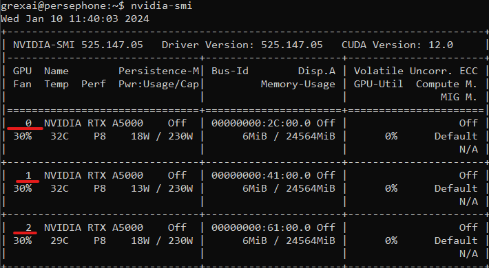

# Terminal commands 

## Useful commands on Linux

### less
Open text files in a scrollable way:
```
less test.txt
```
You can navigate the file using the arrow keys.\
Quit the file by hitting q.\
Note: less does not have to read the entire input file in one go, so it is very handy to open large files.

***

### man
Open system manual pager for installed programs
```
man less
```
Man is helpful to explore a CLI program's expected options, arguments and other capabilities.

***

### pwd
Print working directiory (same as the current directory)
```
pwd
```

#### Path basics
There are some special paths in linux:
* `.` relative path to the current directory
* `..` relative path to a directory a level above the current directory
* `/` absolute path to the root directory
* `~` (tilde) this is an absolute path to the logged in user's home directory, It is defined in the envoronmental variable `$HOME`

Examples for relative path: `./Document` or `../../dev/null` \
Examples for absloute paths: `/home/username/Document` or `~/Document`

You can also use the `*` and `?` wildcards in paths (there are other globbing patterns too):
* `?` represent one joker character
* `*` represents any number of characters

**Examples:**\
Let we have a directory with the following files in it:
```
asd.txt    asd.csv    brekeke.txt
```
* `./asd.*` will match `asd.txt` and `asd.csv`
* `./asd.?` won't match anything
* `./asd.???` will match `asd.txt` and `asd.csv`
* `*.txt` will match `asd.txt` and `brekeke.txt`

***

### cd
Change the current directory to the path provided:
```
cd ~/Documents/
```
If a path is not provided cd takes you to your home directory (~):
```
cd
```
A dash as an argument will take you to the previous directory visited:
```
cd -
```

***

### ls

ls lists the files at the provided paths:
```
ls ./Documents
```

Most handy switches to use with ls:
* `-a`  lists all files (even hidden files which name starts with a dot)
* `-l` uses long format with the following fields
```
-rwxrw-r--    10    root   root 2048    Jan 13 07:11 afile.exe
?UUUGGGOOOS   00  UUUUUU GGGGGG ####    MON DD XX:XX FILENAME
^ ^  ^  ^ ^    ^      ^      ^    ^      ^            ^- Filename.
| |  |  | |    |      |      |    |      \-------------- Time of last modification.
| |  |  | |    |      |      |    \--------------------- File Size OR for directory size of the metadata.
| |  |  | |    |      |      \-------------------------- Group Name (for example, Users, Administrators, etc)
| |  |  | |    |      \--------------------------------- Owner Account
| |  |  | |    \---------------------------------------- Link count (what constitutes a "link" here varies)
| |  |  | \--------------------------------------------- Alternative Access (blank means none defined, anything else varies)
| \--\--\----------------------------------------------- Read, Write and Special access modes for [U]ser, [G]roup, and [O]thers (everyone else)
\------------------------------------------------------- File type flag
```
* `-h` makes the sizes human readable: eg. instead of `2888249` in bytes it is printed as `2.8M`
Example for using switches:
```
ls -lah
```
***

### cp, mv, ln, rm

#### cp
Copy files to a specified destination:
```
cp source/path/file1.txt target/path/file1.txt
```
Use `-r` `--recursive` switch for multiple files and directories:
```
cp -r source/path/* target/path/
```

#### mv
Moves a file or directory to the target path:
```
mv source/path/file1.txt target/path/file1.txt
```
#### ln
Create a hard link to a file:
```
ln source/path/file1.txt target/path/file1.txt
```
A hard link can only be created on the same filesystem. If the original file is moved, the hard link will be still valid. \
Create symbolic(soft) link to a file:
```
ln -s source/path/file1.txt target/path/file1.txt
```
Soft links can span between filesystems. however they will break if the original file is renamed, moved or deleted. \
Links are very useful for example to make "shortcuts" for binaries or scripts to a folder which are in the `$PATH` environmental variable. That way the will be callable from anywhere. Don't overdo it.
#### rm
Remove a file or files form the filesystem:
```
rm file
```
You can remove empty directories with `rmdir`:
```
rm directory
```
Handy switches:
* `-r` removes files and directories recursively. You can remove non empty folders with this command
* `-f` force remove: won't prompt for warning (Only use this if you must)
* `-d` remove **empty** directories
Example:
```
rm -r ./nonempty-dir
```

***


Run shell script
bash script.sh or 
```
./script.sh
```


chmod command can change permissions to file
For example this makes script.sh executable
```
chmod +x script.sh
```

Use ls command to check permissions 
ls -l
This will list the nvidia video cards, usage and status. 
Devices Ids underlined with red.
```
nvidia-smi  
```

<br>

To restrict videocard usage to  number you can specify it  your python code
or

run your script with "CUDA_VISIBLE_DEVICES=deviceid(s)"

This example will run the script on the  0 and 1 ID GPUs
```
CUDA_VISIBLE_DEVICES=0,1 python3 train_deep_learning_important_unique_word_champion_segmentation.py
```

This will list the CPU, RAM usage and processes  similar to task manager
```
htop
```

you can kill  processes using this command


kill <check_for  pid in htop example>
```
kill 30850
```

if you have a stuck  process  or  you would  like  to cancel it  use

CTRL +  C


## SSH 
connect to remote server on ssh:

ssh user@server
password

### ssh tunneling

Ssh tunnel allows to forward port from a remote machine securely.

ssh -f -n -L LOCALPORT:serveradress:PORT user@server

In this case remote host 8001 port will be forwared to local 8000 port


example run  on local pc:
-f and -N commands allow to run it in background
```
ssh -f -N -L 8000:localhost:8001 user@server

```

## Scp
Copy files to remote server:

```
scp file.txt ```username```@minerva://storage01/```username```/
```


##  BIOMAG GPU servers:

- minerva
- diana
- persephone


## Virtualenv

Virtualenv is a tool to create isolated Python environments. This will  help you to keep your projects organized.

### Create virtualenv 
virtualenv path/to/env 

select python  verison:
to select python verison add the path of installed python like

/bin/python


### Activate virtualenv

Linux 
```
source path/to/env/bin/activate
```
  
Windows 
Use windows Powershell  or gitbash
if not  enabled to run scripts  run in powershell
```
set-executionpolicy remotesigned
```

```
.\path\to\env\Scripts\activate
```

### python package manager PIP

Install python packages with PIP

```
pip install opencv-python
```

If you have multiple package collect them into a requirements.txt file  and  
```
pip install -r requirements.txt
```


## Tmux

Tmux is a terminal multiplexer. It lets you switch easily between several programs in one terminal, detach them (they keep running in the background) and reattach them to a different terminal.

start a new session
```
tmux
```
exit from that session
```
tmux detach
```
attach  the first session

```
tmux a -t0
```

Commands

vertical split<br>
ctrl b + %
horizonatal split  <br> 
ctrl b + "

switch between  panes

ctrl b + arrow <br> 


Link to more :

https://tmuxcheatsheet.com/


## Jupyter server
Login to the server using ssh<br>
Create a virtual  enviroment for you project

```
pip install jupyter-notebook
```

Run jupyter server with the following command, set the port with --port 
```
jupyter-notebook --no-browser --port=8001
```


On local pc, create ssh tunnel that allows port forwarding

ssh -f -N -L 8000:localhost:8001 user@server


## GIT

Install git, on Ubuntu it is install by default. On windows it is suggest to install git bash 

Download a repository
```
git clone repositry
```
This will list the changes that are not commited
```
git status
```

```
git add <file_that changed>
```
```
git commit -m " a commit message like i have added a new function or changed this function"
```
```
git push origin <branch>
```
```
git checkout <branch>
```

add ".gitignore" file list the files that should not be uploaded: for example images, buld files  or virtualenv.
This example will ignore build,  dist __pychache__ folders,  files with  png,  and  spec  extenstion, and will  allow png files from  images  folder

```
build
dist
__pycache__
*.png
!images/*.png
*.spec
```


 # Windows softwares
 <br>
git bash https://www.git-scm.com/downloads
VSCODE https://code.visualstudio.com/ <br>
Bitwise
https://www.bitvise.com/ssh-client-download <br>

# Homework


- Push your python code into a repository that uses GPU, generates output (for example images, tables, texts,...)
- Connect to a server remotely. 
- Download your code.
- Check for avaliable gpus
- Run you code on one free GPU
- Download your results or model from server
